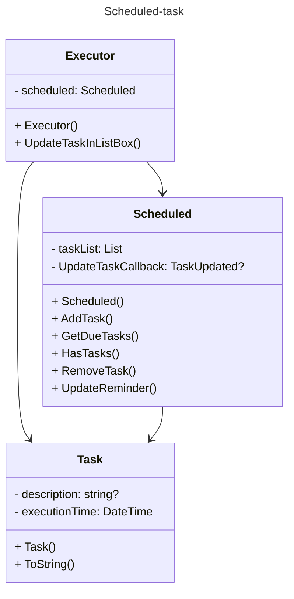
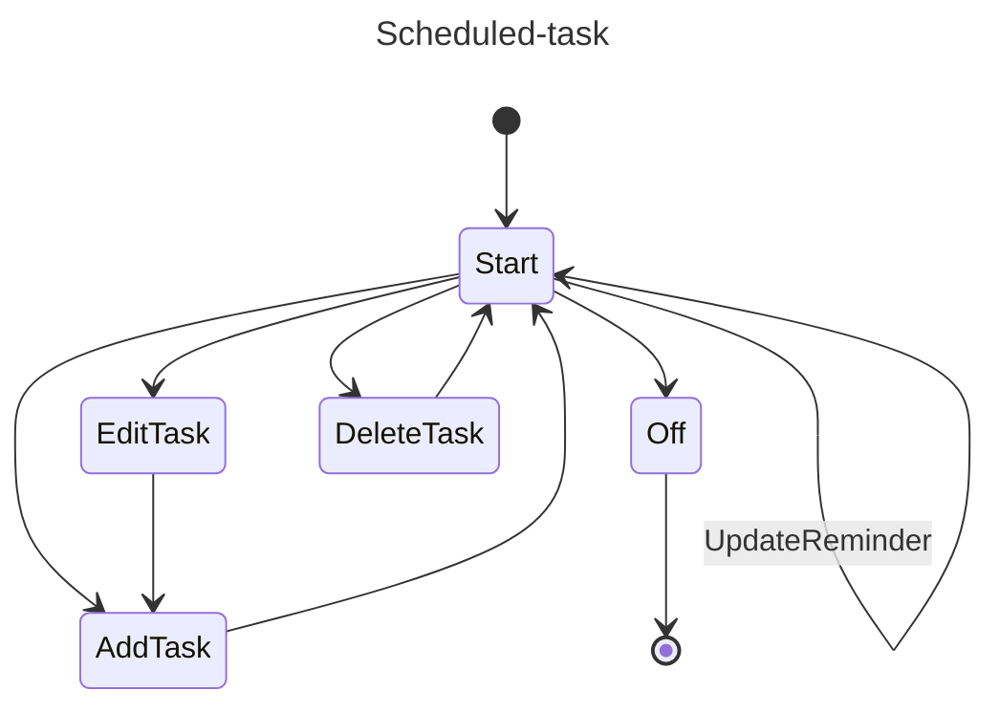

****
# :star2:  `Scheduled-task`

### :black_nib:	Призначення та застосування шаблону
#### **Заплановане завдання** — патерн проектування, який використовується в системах реального часу для ефективного управління завданнями. Затримує виконання завдань до заздалегідь визначеного часу.
#### **Застосування:**
- Дозволяє виконувати завдання **у визначений час**, забезпечуючи реалізацію запланованих процесів і подій у системі;
- Допомагає **ефективно керувати** системними **ресурсами** та запобігати конфлікту ресурсів;
- **Полегшує обробку запланованих подій**, таких як періодичне оновлення даних, завдання з обслуговування системи або сповіщення за розкладом.

### Діаграми класів та стану

##### Class Diagram Scheduled-task:

##### State Diagram Scheduled-task:

### Опис основних структурних елементів :
- **Scheduled** - клас, що відповідає за планування завдань. Він надає методи для додавання завдань до розкладу, визначення часу їх виконання та обробки;
- **Task** - клас, що описує окреме завдання, яке потрібно виконати. Містить логіку та параметри, необхідні для виконання;
- **Executor** - виконавець.

###### На діаграмі станів зображено конкретну реалізацію по шаблону. 

### Джерела інформації:
##### - [en.wikipedia.org](https://en.wikipedia.org/wiki/Scheduled-task_pattern)
##### - [subscription.packtpub.com](https://subscription.packtpub.com/book/programming/9781785887130/5/ch05lvl1sec61/scheduled-task-pattern)
##### - [wintercms.com](https://wintercms.com/docs/v1.2/docs/plugin/scheduling)
****